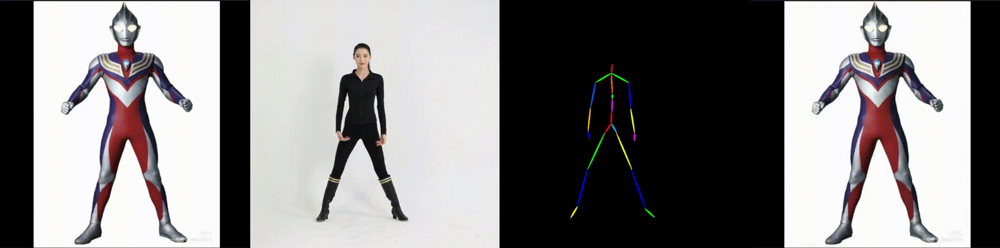

<meta name="google-site-verification" content="-XQC-POJtlDPD3i2KSOxbFkSBde_Uq9obAIh_4mxTkM" />

<div align="center">

<h2><a href="https://www.arxiv.org/abs/2505.10238">MTVCrafter: 4D Motion Tokenization for Open-World Human Image Animation</a></h2>

> Official project page of **MTVCrafter**, a novel framework for general and high-quality human image animation using raw 3D motion sequences.

<!--
[Yanbo Ding](https://github.com/DINGYANB),
[Shaobin Zhuang](https://scholar.google.com/citations?user=PGaDirMAAAAJ&hl=zh-CN&oi=ao), 
[Kunchang Li](https://scholar.google.com/citations?user=D4tLSbsAAAAJ), 
[Zhengrong Yue](https://arxiv.org/search/?searchtype=author&query=Zhengrong%20Yue), 
[Yu Qiao](https://scholar.google.com/citations?user=gFtI-8QAAAAJ&hl), 
[Yali Wang†](https://scholar.google.com/citations?user=hD948dkAAAAJ)
-->

[](https://www.arxiv.org/abs/2505.10238)
[](https://github.com/DINGYANB/MTVCrafter)
[](https://huggingface.co/yanboding/)
[](https://dingyanb.github.io/MTVCtafter/)

</div>


## 📌 ToDo List

- [x] Release **global dataset statistics** (mean / std)  
- [x] Release **4D MoT** model  
- [x] Release **MV-DiT-7B** (based on *CogVideoX-5B*)  
- [ ] Release **MV-DiT-21B** (based on *Wan-2.1-14B*)
- [ ] Release a Hugging Face Demo Space


## 🔍 Abstract

Human image animation has attracted increasing attention and developed rapidly due to its broad applications in digital humans. However, existing methods rely on 2D-rendered pose images for motion guidance, which limits generalization and discards essential 3D information.  
To tackle these problems, we propose **MTVCrafter (Motion Tokenization Video Crafter)**, the first framework that directly models raw 3D motion sequences for open-world human image animation beyond intermediate 2D representations.

- We introduce **4DMoT (4D motion tokenizer)** to encode raw motion data into discrete motion tokens, preserving 4D compact yet expressive spatio-temporal information.
- Then, we propose **MV-DiT (Motion-aware Video DiT)**, which integrates a motion attention module and 4D positional encodings to effectively modulate vision tokens with motion tokens.
- The overall pipeline facilitates high-quality human video generation guided by 4D motion tokens.

MTVCrafter achieves **state-of-the-art results with an FID-VID of 6.98**, outperforming the second-best by approximately **65%**. It generalizes well to diverse characters (single/multiple, full/half-body) across various styles.

## 🎯 Motivation


Our motivation is that directly tokenizing 4D motion captures more faithful and expressive information than traditional 2D-rendered pose images derived from the driven video.

## 💡 Method


*(1) 4DMoT*:
Our 4D motion tokenizer consists of an encoder-decoder framework to learn spatio-temporal latent representations of SMPL motion sequences,
and a vector quantizer to learn discrete tokens in a unified space.
All operations are performed in 2D space along frame and joint axes.


*(2) MV-DiT*:
Based on video DiT architecture,
we design a 4D motion attention module to combine motion tokens with vision tokens.
Since the tokenization and flattening disrupted positional information,
we introduce 4D RoPE to recover the spatio-temporal relationships.
To further improve the quality of generation and generalization,
we use learnable unconditional tokens for motion classifier-free guidance.


## 🎞️ Animation





---

## 🛠️ Installation

We recommend using a clean Python environment (Python 3.10+).

```bash
git clone https://github.com/your-username/MTVCrafter.git
cd MTVCrafter

# Create virtual environment
conda create -n mtvcrafter python=3.11
conda activate mtvcrafter

# Install dependencies
pip install -r requirements.txt
```

For models regarding:

1. Download the NLF-Pose estimator we use (`nlf_l_multi.torchscript`) from the [NLF Release Page](https://github.com/isarandi/nlf/releases).

2. Download the pretrained CogVideoX-5B checkpoint from [CogVideoX-5B on Hugging Face](https://huggingface.co/THUDM/CogVideoX-5b).

3. Download our MV-DiT and 4DMoT checkpoint from  [MTVCrafter Checkpoints on Hugging Face](https://huggingface.co/yanboding/MTVCrafter).


## 🚀 Usage

To animate a human image with a given 3D motion sequence,
you first need to obtain the SMPL motion sequnces from the driven video:

```bash
python process_nlf.py "your_video_directory"
```

Then, you can use the following command to animate the image guided by 4D motion tokens:

```bash
python infer.py --ref_image_path "ref_images/human.png" --motion_data_path "data/sample_data.pkl" --output_path "inference_output"
```

- `--ref_image_path`: Path to the image of reference character.
- `--motion_data_path`: Path to the motion sequence (.pkl format).
- `--output_path`: Where to save the generated animation results.

For our 4DMoT, you can run the following command to train the model on your dataset:

```bash
accelerate launch train_vqvae.py
```


## 📄 Citation

If you find our work useful, please consider citing:

```bibtex
@misc{ding2025mtvcrafter4dmotiontokenization,
      title={MTVCrafter: 4D Motion Tokenization for Open-World Human Image Animation}, 
      author={Yanbo Ding and Xirui Hu and Zhizhi Guo and Yali Wang},
      year={2025},
      eprint={2505.10238},
      archivePrefix={arXiv},
      primaryClass={cs.CV},
      url={https://arxiv.org/abs/2505.10238}, 
}
```

## 📬 Contact

For questions or collaboration, feel free to reach out via GitHub Issues
or email me at 📧 yb.ding@siat.ac.cn.
