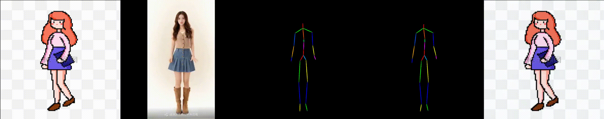

# MTVCrafter: 4D Motion Tokenization for General Human Image Animation

> Official project page of **MTVCrafter**, a novel framework for general and high-quality human image animation using raw 3D motion sequences.

## 🔍 Abstract

Human image animation has attracted increasing attention and developed rapidly due to its broad applications in digital humans. However, existing methods rely on 2D rendered pose images for motion guidance, which limits generalization and discards essential 3D information.  
To tackle these problems, we propose **MTVCrafter (Motion Tokenization Video Crafter)**, the first framework that directly models raw 3D motion sequences for human image animation beyond intermediate 2D representations.

- We introduce **4DMoT (4D motion tokenizer)** to encode raw motion data into discrete motion tokens, preserving compact but expressive spatio-temporal information.
- Then, we propose **MV-DiT (Motion-aware Video DiT)**, which integrates a motion attention module and 4D positional encodings to effectively modulate vision tokens with motion tokens.
- The overall pipeline facilitates high-quality human video generation guided by 4D motion tokens.

MTVCrafter achieves **state-of-the-art results with an FID-VID of 6.98**, outperforming the second-best by approximately **65%**. It generalizes well to diverse characters (single/multiple, full/half-body) across various styles.

## 🎯 Motivation

## 🎞️ Animation Results

---

## 📄 Citation

Coming soon.

## 📬 Contact

For questions or collaboration, feel free to reach out via GitHub Issues.
